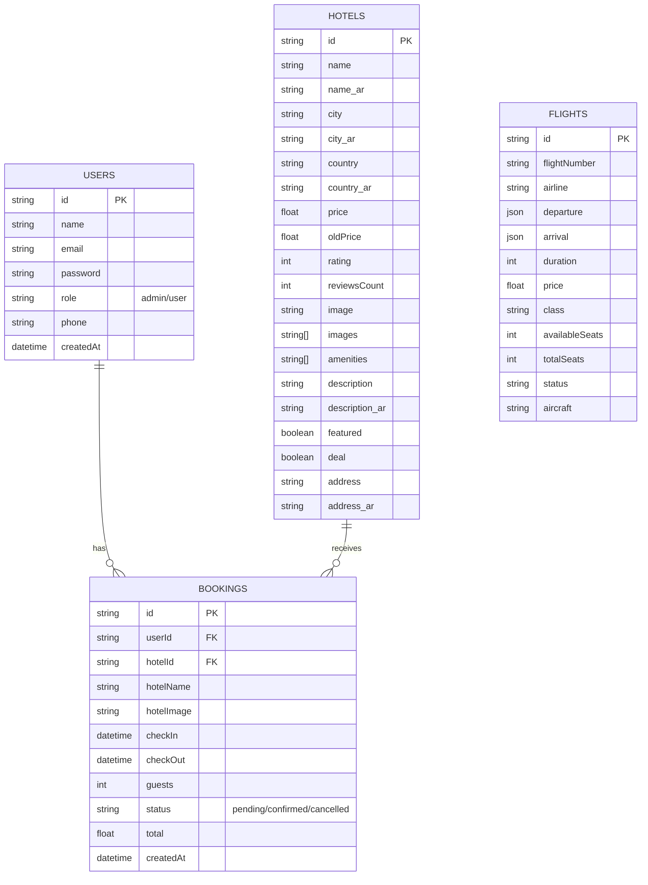

# Database Schema (مخطط قاعدة البيانات)

هذا المستند يحتوي على مخطط الجداول (Database Schema) لتطبيق Stayly الخاص بك. 

## Entity Relationship Diagram (ERD)

## Tables Details (تفاصيل الجداول)

### 1. جدول المستخدمين (Users Table)
يحتوي على بيانات المستخدمين المسجلين في النظام، سواء كانوا مدراء (Admins) أو مستخدمين عاديين (Users).
- **id**: المُعرف الفريد للمستخدم (Primary Key).
- **name**: اسم المستخدم.
- **email**: البريد الإلكتروني.
- **password**: كلمة المرور.
- **role**: دور المستخدم (admin/user).
- **createdAt**: تاريخ إنشاء الحساب.

### 2. جدول الفنادق (Hotels Table)
يحتوي على بيانات الفنادق المعروضة للحجز وتفاصيلها الداعمة للغتين العربية والإنجليزية.
- **id**: المُعرف الفريد للفندق (Primary Key).
- **name**: اسم الفندق (إنجليزي).
- **name_ar**: اسم الفندق (عربي).
- **city** / **city_ar**: المدينة (إنجليزي/عربي).
- **country** / **country_ar**: الدولة (إنجليزي/عربي).
- **price**: سعر الليلة.
- **rating**: التقييم (من 1 إلى 5).
- **amenities**: المزايا المتاحة في الفندق (مسبح، واي فاي، الخ).
- **description** / **description_ar**: الوصف الكامل للفندق.

### 3. جدول الحجوزات (Bookings Table)
يحتوي على حجوزات المستخدمين ويربط كل مستخدم بجدول الفنادق.
- **id**: المُعرف الفريد للحجز (Primary Key).
- **userId**: مُعرف المستخدم صاحب الحجز (Foreign Key).
- **hotelId**: مُعرف الفندق المحجوز (Foreign Key).
- **checkIn**: تاريخ الوصول.
- **checkOut**: تاريخ المغادرة.
- **guests**: عدد الضيوف.
- **status**: حالة الحجز (مؤكد confirmed، ملغي cancelled).
- **total**: إجمالي السعر.

### 4. جدول رحلات الطيران (Flights Table)
يحتوي على رحلات الطيران المتاحة للبحث في المنصة.
- **id**: المُعرف الفريد للرحلة.
- **flightNumber**: رقم الرحلة.
- **airline**: شركة الطيران.
- **departure**: بيانات الانطلاق (مطار، مدينة، دولة، وقت).
- **arrival**: بيانات الوصول.
- **price**: سعر التذكرة.
- **class**: درجة السفر (اقتصادية وغيرها).
- **status**: حالة الرحلة (مجدولة scheduled وغيرها).
